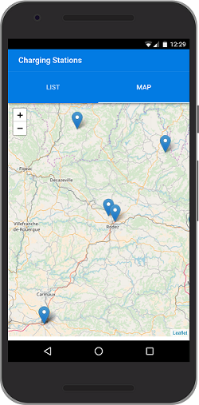

## Build Setup

``` bash
# install dependencies
$ npm install -g quasar-cli
$ npm install


# serve with hot reload at localhost:8080
$ quasar dev
$ quasar dev

# build for production with minification
$ quasar build



